> 📌 단축키
> F9 메인 함수의 entry point로 이동
> F8 한줄한줄 실행
> ctrl + F2 초기화
> space 명령어 주작

# Basic RCE L01

HDD를 CD-Rom으로 인식시키기 위해서는 GetDriveTypeA의 리턴값이 무엇이 되야 하는가?

## 풀이

esi 레지스터와 esx 레지스터에 덧셈과 뺄셈을 반복하며 내려가다가

cmp eax, esi 구문을 실행하고 je 구문에서 같으면 점프한다.

이때 두 값이 같으면 “Ok, I really think that your HD is a CD-ROM! :p” 문구가 출력되고 다르다면 “Nah… This is not a CD-ROM Drive!” 문구가 출력된다.

따라서 cmp eax, esi 구문이 true가 되어야 한다.

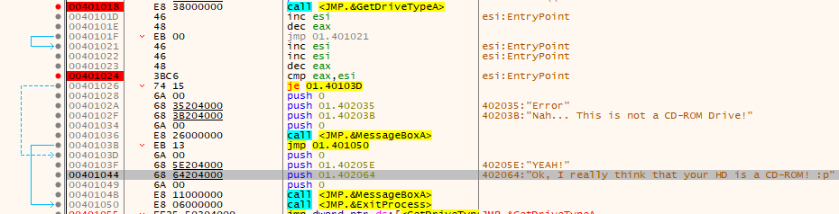

## 실행

### 두 값을 똑같게 만들어주기

cmp eax, esi가 실행되는 곳에 breaking point를 걸고 값을 직접 입력해 바꿔준다.

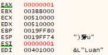

### 조건문 바꾸기

값이 같을 때 점프하는 je 구문(jump equal)을 다를 때 점프하도록 not 조건을 추가한다. (jump not equal)

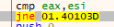

## 정답

CDROM의 return value는 5이다.

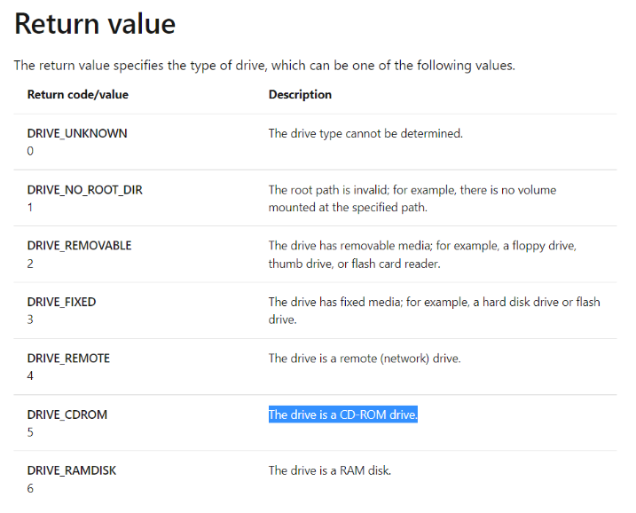

 

# Basic RCE L02

패스워드로 인증하는 실행파일이 손상되어 실행이 안 되는 문제가 생겼다. 패스워드가 무엇인지 분석하시오.

## 풀이

HxD에서 PE 파일을 열어보았다.

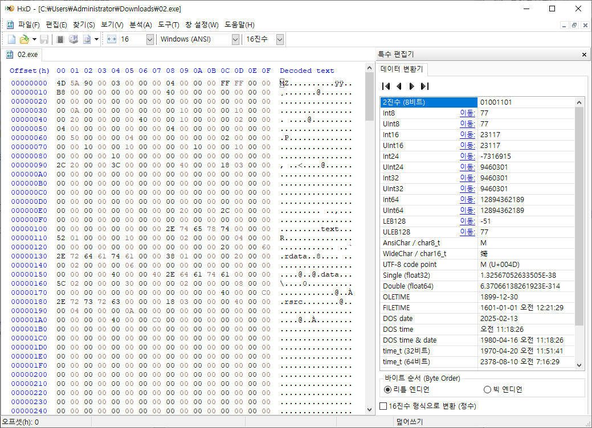

내리다보니 비밀번호를 찾았다.

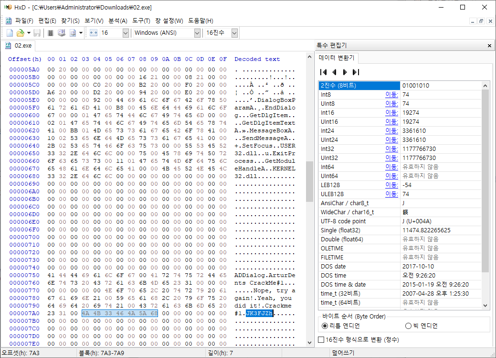

## 정답

JK3FJZh

 

# Basic RCE L03

비주얼베이직에서 스트링 비교함수 이름은?

## 풀이

프로그램을 실행하면 다음과 같은 창이 뜬다.

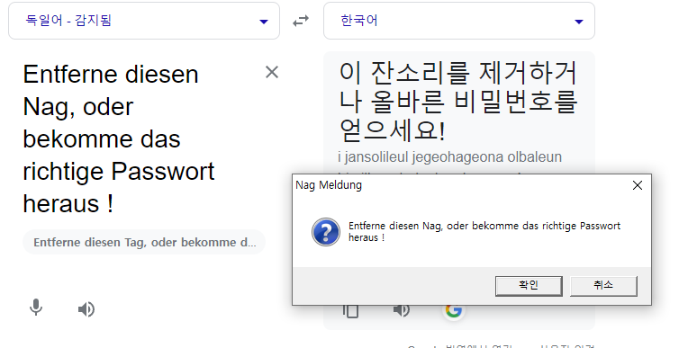

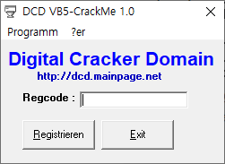

Regcode에 아무거나 넣어보면 비밀번호가 틀렸다고 뜬다.

해당 문자열을 검색해 들어간다.

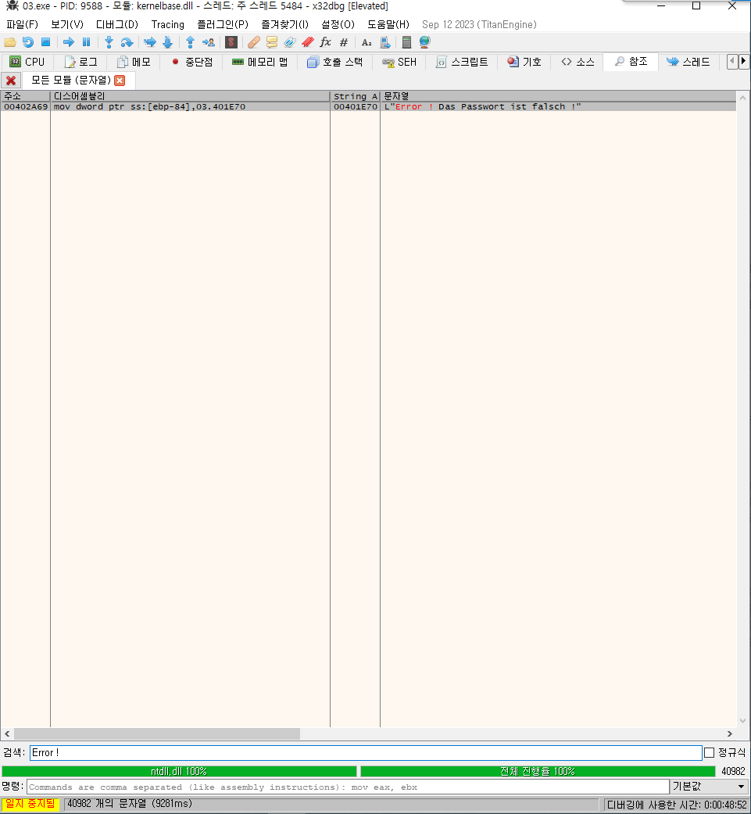

그럼 문자열을 비교하는 구문을 만날 수 있다.

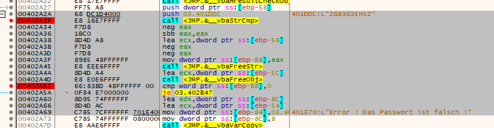

그리고 그 위에 수상한 문자열 2G83G35Hs2을 입력하면 비밀번호가 맞다고 나온다.

## 정답

그러므로 그 사이 세 개의 함수 중 하나가 문자열을 비교하는 함수이므로 vbaStrCmp이다.

 

# Basic RCE L04

이 프로그램은 디버거 프로그램을 탐지하는 기능을 갖고 있다. 디버거를 탐지하는 함수의 이름은 무엇인가

## 풀이

디버깅을 시작함과 동시에 다음 문자열이 출력된다.

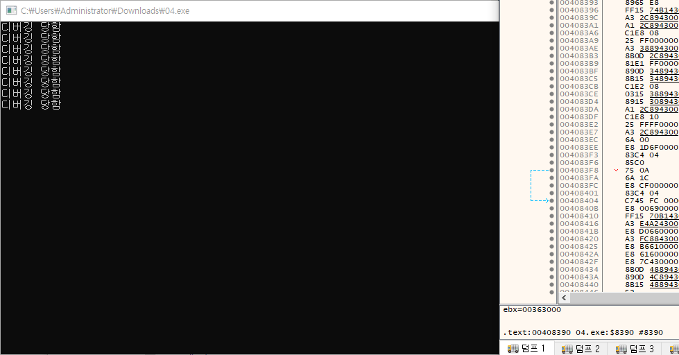

문자열을 검색해 찾아본다

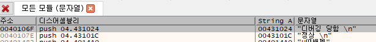

## 정답

들어가보니 누가봐도 디버깅을 탐지하는 함수의 이름은 IsDebuggerPresent 같다.

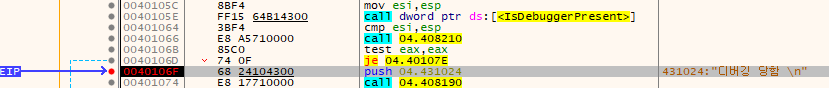
