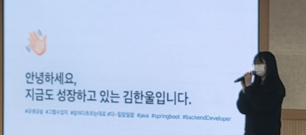
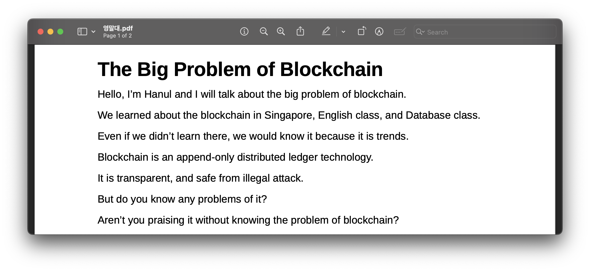
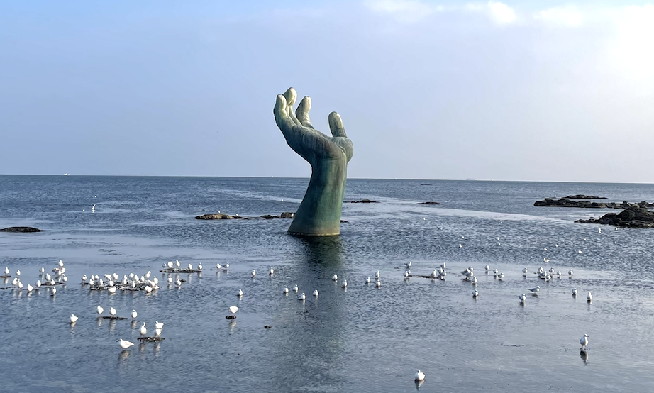
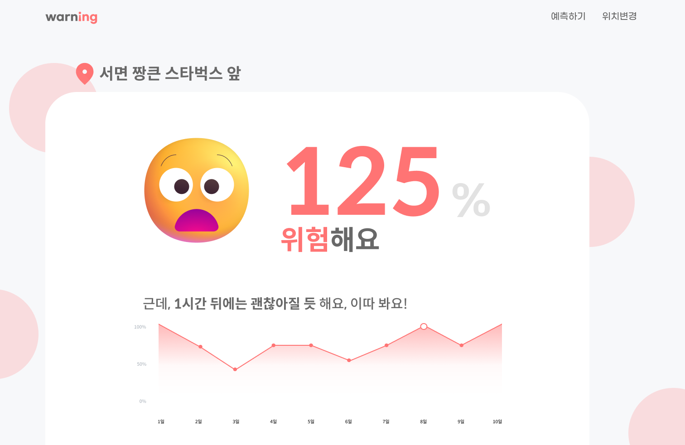
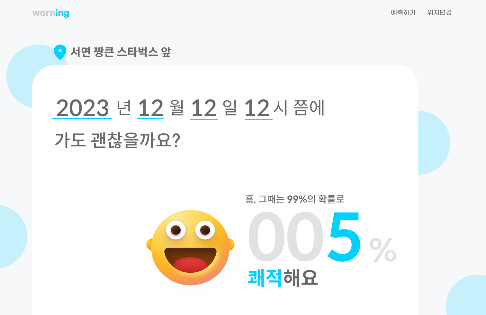
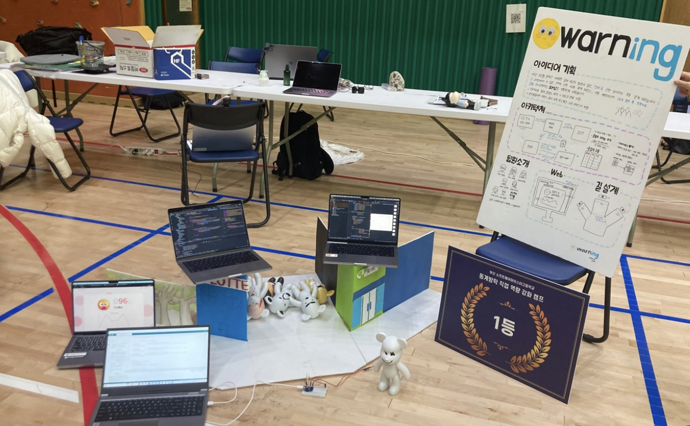
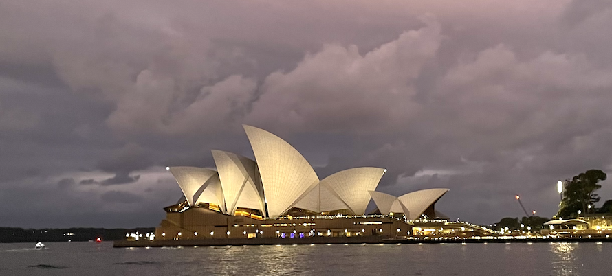
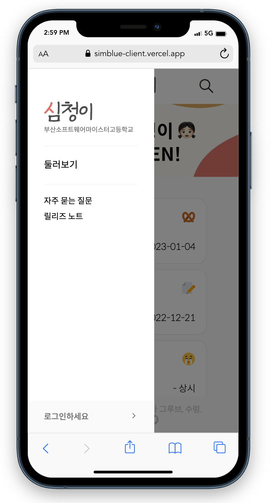
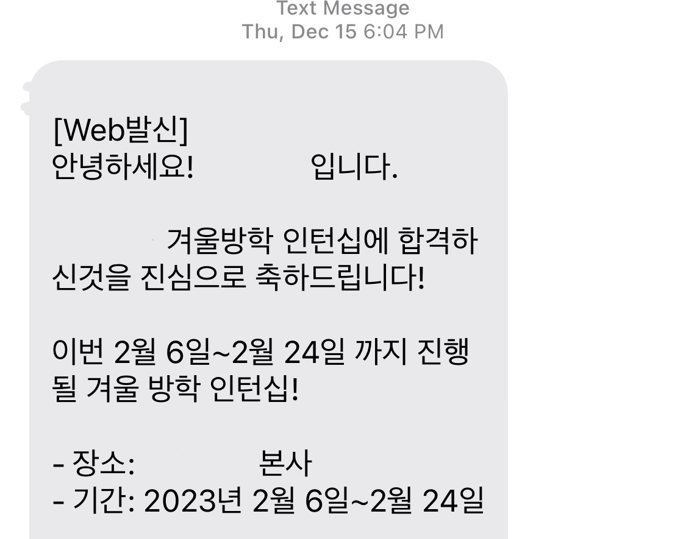

# 칸쵸 먹으면서

쓰는 서문

제목으로는 인턴십 회고인 척 어그로를 끌었지만 사실 이 글은 겨울방학 회고이다.

어차피 하는 거 그냥 1월부터 해야겠다.

# 포트폴리오 경진대회

교내 포트폴리오 경진대회에 참가했다. 진즉에 써 놓은 포폴이 있어서 그냥 pdf만 따서 내고, 1학년에게 꿀팁 주는 느낌으로 발표를 했다. 최우수상을 받았다. 히히.

포트폴리오 꿀팁

- 프로젝트만 설명하지 말고, 그 프로젝트를 하면서 내가 **맡은 역할**이 무엇인지 기록하기
- 프로젝트를 하면서 만났던 **이슈와 해결 과정, 배운점** 기록하기
- 기술 외적인 부분(=**인성, 협업** 등)도 강조하기

# 영어 말하기 대회

학교에서 역량을 측정하는 제도가 있는데(일명 마이스터 역량 인증제) 외국어 영역 점수를 채우고 싶어서 영어 말하기 대회에 나갔다. 블록체인을 쓸 일이 생겨서 요즘 관심사가 블록체인이기 때문에 블록체인에 대해 발표를 하기로 했다.

대본을 준비하면서 블록체인에 대한 이해도가 한층 더해진 것 같다. 발표를 하면서 까먹고 난리도 아니였지만 우수상을 받았다. 느낀 건 자신감만 있으면 반은 먹고 들어간다는 것이다. 작년에도 영어 말하기 대회에서 우수상이었는데, 난 만년 우수상인 것일까…

# 가족 여행

엄마와 포항, 경주 여행을 갔다. 포항 손 한 번 보는 게 꿈이었는데 결국 봤다. 갈매기가 엄청 많아서 싫었다. 근데 진짜 적당히 있으면 ‘쟤네도 먹고 살아야지…’ 같은 생각을 했을텐데 많아도 너무 많았다. 경주에서는 동궁과 월지가 가장 기억에 남는다. 엄청 예쁘다. 이제 취업하면 이렇게 엄마랑 여행도 잘 못다닐 것 같다. 그래서 더 의미있는 여행이었던 것 같다.

# 교내 해커톤

가족 여행을 마치고 바로 학교로 갔다. 학교를 빠지고 여행을 갔던 건데, 내가 학교를 가는 날부터 해커톤 시작이었다. 이번 해커톤은 **자본주의** 해커톤이었다. (학교에서도 그냥 놀면서 쉬엄쉬엄 하자고 기획했다고 한다)

## 자본주의 해커톤

쉽게 말하면 그냥 화폐가 있는 해커톤이다. 모든 게 다 돈이다. 간식도 돈으로 사먹어야 하고, 시장에 풀리는 돈의 양에 따라 인플레이션, 디플레이션이 온다. 게임이나 이벤트를 통해 크레딧(=화폐)를 얻을 수 있고, 크레딧으로 모니터도 대여할 수 있고 심지어는 팀도 인수합병할 수 있다.

## 팀 빌딩

진짜 웃긴 게 난 해커톤에 늦게 도착해서 기차역에서 친구한테 연락을 받고 내가 들어갈 팀을 꾸려놨다.  (팀 빌딩 자유) 백엔드는 나 혼자 커버 가능하니까 백엔드 데려오지 말라는 말도 함께였다.

기차를 타고 부산에 가고 있는데 전화가 하나둘씩 걸려왔다. “선배… 선배는 여기 없어서 저희 팀에 못 넣는대여… 저희 어떡해여?…”

다음날 아침 나는 **경매**에 부쳐졌다. 한 마디 하라는 말에 나는 사봐야 아무것도 할 줄 몰라서 아무것도 못한다는 말을 했다. 하지만 경매는 5 크레딧부터 시작이었고 내가 가기로 한 팀은 1 크레딧밖에 없었다. 자본주의의 쓴 맛을 느낀 그 팀의 이름은 원크레딧이 된다…

나는 결국 부잣집에 팔려갔다. 백엔드가 없어서 갖가지 스택들을 합치지를 못한다고 했다.

## 와닝

우리는 최근 있었던 이태원 사태를 보고 사람이 많은 곳의 위험성을 자각했다. 그래서 인공지능을 통해 인구 밀집도를 파악하고, 인구 밀집도에 따라 도로 가의 조명이 다른 색으로 켜져서 사람들이 위험을 인지할 수 있도록 하는 프로젝트를 기획했다. 그뿐만 아니라, 쌓인 데이터를 통해 앞으로의 밀집도를 웹을 통해서 예측하고, 현재 가고자 하는 장소의 밀집도를 확인하고, 과거 분석도 볼 수 있다.

### 현재 밀집도 확인 화면

### 예측 화면

### 즐거운 우리들 ^.^

## 소감

팀원들이 다 다른 스택으로 어우러지는 게 신기했다. 한명한명 까보면, 프론트, 백엔드, AI, 임베디드2, 데이터 분석, 디자이너(?)가 있었는데, 각 팀원들의 스택을 알짜배기로 사용한 프로젝트였다. 해커톤 운영을 재밌게 해서 재밌었고, 결과적으로 대상을 받았다. 구현을 잘 해서 그런 것 같다.

# 우수학생 글로벌 SW 역량 강화 프로그램

2학년 1학기 중간고사를 잘 쳐서 우수학생이 되어버렸다. 그래서 해커톤이 끝나자마자 6박 8일간 호주로 떠났다.

호주에서 말이 안 나오게 아름다운 풍경을 눈에 담고, 호주의 IT 산업과 전망, 우리나라와의 차이점 등과 같은 강연을 들었다. 다녀와서 든 생각은 호주는 정말 아름답고, 평화롭고, 나도 언젠가 호주에 가서 살고 싶다는 것이다.

이 글을 읽는 사람들, (솔직히 별로 없을 것 같긴 하지만) 한 번 쯤은 호주에 꼭 가보길 바란다. 솔직히 한 번 가면 또 가고 싶어서 가만히 못 있을 것이다.

# 심청이

한국에 돌아오자마자 심청이 스프린트 할 일을 시작했다. 심청이의 이번 태스크는 베타 사용 기간에 들어왔던 반응형 중심이었는데, 난 백엔드라 해당 사항이 없어서 소소한 기능들을 추가했다. 이렇게 상세하게 스프린트 형식으로 일을 하는 건 처음이라서 일정이 정해져있다는 안정감 + 애들이 다 책임을 다하는 것에 대한 뿌듯함으로 중무장한 바쁜 일주일을 보냈다. 스프린트 끝나는 날에 프로덕션 배포도 하고, 릴리즈 노트도 작성했다. 예상치 못한 반응형 이슈(모바일에서는 100vh가 주소창 때문에 안 맞는 문제 등등…)도 겪으면서 한층 더 성장한 것 같다. 꼼꼼이 개발자 느낌?

지금은 2월 스프린트를 하고 있는데 난 내 할일을 마쳤다. 새로운 기능으로 찾아뵙겠읍니다… ㅎㅎ%%

# 기타 공부

아까 언급한듯이 블록체인을 쓸 일이 생겨서 모아놓은 문상으로 인터넷 강의를 질렀다. 블록체인 강의를 꾸준히 보고, 도메인 주도 개발 책을 읽으며 DDD에 대해 공부했다. DDD의 가장 흥미로운 점은 지금껏 디비 매핑용 객체로만 썼던 엔티티에게 역할과 책임을 주는 것인데, 서비스 단에서 처리했던 많은 일이 객체가 직접 수행해야 하는 일이었다는 걸 배웠다.

# 인턴십

판교로 인턴을 하러 올라갔다. 회사에서는 같은 인턴끼리 작은 프로젝트를 했는데, 우리 팀에서는 역량 검사를 위한 새로운 게임의 프로토타입을 만드는 것을 과제로 받았다.

## 기획서

사실 가장 놀란 것은 기획이다. 지금껏 학교에서 개발을 할 때는 기획부터 디자인, 개발, 테스트, 배포 등 하나의 서비스를 만드는 데 필요한 모든 프로세스를 우리가 했다. 하지만 회사에 가니, 기획을 하는 사람이 따로 있고 디자인 하는 사람도 따로 있고 개발도 따로 있고 배포도 따로 있었다. 또한 학교에서는 주먹구구식으로 기획도 대충 갈겨 놓고 개발을 시작하는데, 우리가 받은 기획서는 엑셀 파일에다가 안의 내용물이 5장은 족히 넘었다. 정책도 상세하게 되어 있었고 점수 계산 로직도 다 정해져 있었다. 심지어 필요한 사진 소스, 디비 구조까지 기획서에 적혀있었다.신기하고, ‘아 이게 현업이구나’ 정도의 생각을 하며, 꼼꼼히 기획서를 읽었다.

## 두 개의 백엔드

백엔드가 두 명이라고 백엔드가 두 개인 건 아니다. 우린 백엔드가 두 명이었는데 둘 스택이 달라서 백엔드가 두 개였다. 나는 스프링, 그 친구는 노드를 사용했다. 스프링과 노드를 nginx로 엮으면서 CICD를 진행했는데 참 시간도 많이 걸리고 어려웠다. 또한 DB는 하나를 쓰면서, 백엔드가 두 개고, 엔티티도 자연스레 두 배이다 보니, 타입 관련해서 문제가 많이 났다.

## 기술적 어려움

기술적으로 이건 이렇게 하는 게 더 낫겠다 싶은 순간이 있었다. 기획서에 적혀있는 디비 구조를 조금만 바꾸면 더 편하게 사용할 수 있을 터였다. 하지만 ‘그냥 조금 불편하게 살지 뭐’ 라는 생각으로 코드를 짜고 이후 멘토님께서 리뷰를 해주실 때 ‘이건 디비 구조 때문에 코드가 좀 더러워요…’ 따위의 변명을 하니까 멘토님께서 그럴 땐 기획을 바꾸면 된다는 말씀을 해주셨다. 그것이 바로 “소통”이고 “협업”이라고… 이 얘기를 듣고는 좀 멍했다. 이를 계기로 이 이후에 다른 문제는 기획자분께 편하게 말씀드릴 수 있었다.

## 아까움

코드를 버리는 걸 왜 아까워하냐는 말을 많이 한 것 같다. 나의 존경 멤버 중 한 분이 쓰신 **코드는 소유물이 아니라는 글**을 읽은 적이 있다. 내가 짠 코드는 그저 글쓴이가 나일 뿐, 코드의 존재가치는 서비스를 위함이라는 글이었다. 인턴을 하면서 이런 상황에 대해 이해하게 되었다. 변경사항은 끝도 없이 나왔고, 이래서 코드를 버리는 걸, 바꾸는 걸 아까워하면 안 된다고 하는 거구나를 느낄 수 있었다.

# 토익

LC와 함께하는 퇴근길… 갬성 고앵이

인턴을 하면서 회사까지는 20분? 정도 회사 버스를 타고 왔고 돌아갈 때는 탄천을 따라 한 시간을 걸어 퇴근했다. 체력 증진과 토익 공부 명목이었는데, 저 시간 동안 LC를 외우듯이 들었다. 집에 들어가서는 LC와 RC 공부, 말해보카를 하며 보냈다. 얼마 전 토익을 보고 왔는게 망했다. 제발 잘 됐으면… (슬픔)

# 비빔면을 끓이면서

아침에 칸쵸 뜯으면서 쓰기 시작한 글을 점심에 비빔면 끓이면서 마치게 되었다. 3학년 취업 파이팅, 쭉긍살, 반배정은 망했지만 그래도 긍… 긍댕이…
