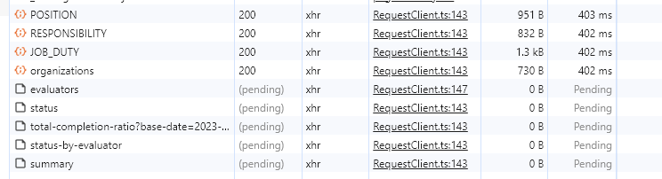
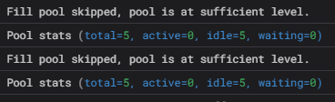
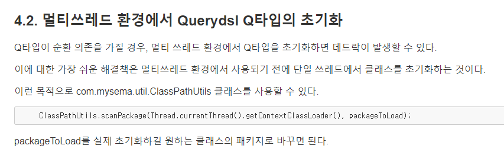
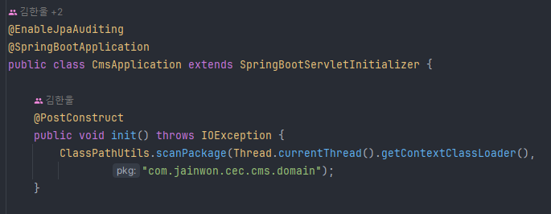
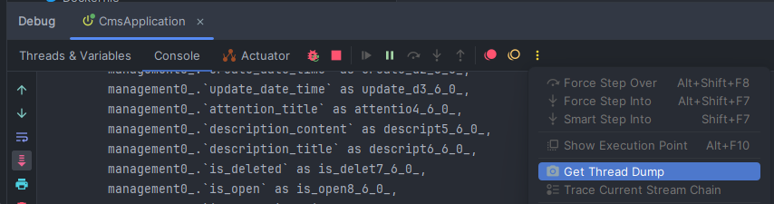
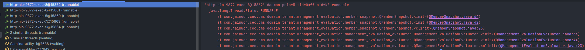

## 문제 발생
한 페이지에서 5개의 api가 pending 상태로만 머물러 있고 응답이 오지 않는 현상이 발생했습니다.

 

## 삽질 엿보기

### 가설1: Hikari Connection Pool Deadlock
가장 먼저 Hikari Connection Pool Deadlock 현상일 것이라고 가정하고 이를 확인했습니다.
connection pool의 상태를 로그로 남겨보았습니다.

문제 상황이 발생하면, (active=5, idle=0, waiting=0) 상태가 됩니다.
이후 보내는 모든 요청은 waiting에서 기다리다가 timeout 됩니다.

#### Connection Pool을 10개까지 늘려보자
connection pool을 10개로 늘려도, 문제 상황이 발생하면 (active=5, idle=5, waiting=0) 상태가 됩니다.
이후 요청을 보낼 때마다 처리가 가능하면 idle 상태의 connection은 active 상태가 됐다가 다시 idle 상태로 돌아오고, 처리가 불가능하다면 active 상태에 머무릅니다.

> **즉, Hikari Connection Pool Deadlock 현상이 아닙니다.** 
> Deadlock 이었다면, Pool 개수를 늘렸을 때 문제가 해결되어야 합니다.

 

### 가설2: Connection Leak
이후 connection leak 로그를 찍어보고 디버깅을 시작했습니다.
connection을 반환하는 곳에 breakpoint를 걸어두고 디버깅을 해본 결과 connection을 잘 가져오고 있었습니다.

그러나 애초에 connection leak은 말을 손바닥 뒤집듯 바꾸는 진중하지 못한 친구입니다.
설정 파일에서 설정한 시간 안에 connection을 가져오지 못할 때 connection leak 로그가 남게 되는데,
늦게라도 connection을 가져오면 “엥 잘되네? 미안미안~ 아니었나부다” 라는 로그를 다시 남깁니다.

#### Connection Leak 로그를 맞닥뜨린 후 문제 없는 다른 api를 호출하자
같은 database에 접근하는 다른 api를 호출했을 때 결과가 잘 왔습니다.

> **즉, Connection Leak 현상이 아닙니다.** 
> connection leak 현상이었다면 다른 api를 호출했을 때도 똑같이 connection leak이 발생했어야 합니다.

 

### 가설3: Database Layer
그렇다면 database와 통신하는 과정에서 문제가 있는 것은 아닐까?

#### 너, 지금 과하게 조인하고 있어
과하게 join하고 있다는 의견을 듣고 과한 join이 일어나는 쿼리를 제외하고 실행도 해보고, 소소한 성능 개선도 했습니다.
이 문제도 아니었습니다.

#### DB에 접속하긴 하나?
의문이 들고난 이후로 connection 이후로 db에 쿼리를 날리는 그 사이를 디버깅했습니다.
결과적으로 한 메서드에서 3개의 쿼리를 날린다고 했을 때, 하나는 쿼리를 날리고 두 개는 쿼리를 날리지 않고 있었습니다.

**connection은 잘 잡아오지만 쿼리를 날리지 않는다.**

 

## 문제 해결

### 삽질하면서 알아낸 내용
- 무한펜딩 api는 공통적으로 2개의 도메인과 관련이 있다.
- 무한펜딩 api 발생 후 위 두 개의 도메인이 아닌 다른 도메인과 관련된 api에 요청을 하면 응답이 잘 온다.
- 이전에 한 번이라도 두 개의 도메인에 접근했다면 무한펜딩 현상이 발생하지 않는다.

### static class는 multi-thread 환경에 영향을 받지 않나?
라는 생각이 들어 관련 키워드로 검색했고 결국 3일 만에 해결했습니다.

A 도메인이 B 도메인을 참조하고, B 도메인이 A 도메인을 참조하는데
멀티 쓰레드 환경에서 5개의 api를 따발총처럼 부르니 querydsl에서 deadlock이 발생해 생긴 문제였습니다.
다음과 같이 단일 thread에서 클래스를 초기화해서 해결했습니다.

#### 확인해보기
'Get Thread Dump'라는 옵션을 누르면 그 시점에 Thread 상태를 dump 떠줍니다.

로그를 들여다 보면 thread가 아직 Runnable한 상태이고, QClass를 초기화하고 나서 아무것도 못하고 가만히 있는다는 사실을 확인할 수 있습니다.

