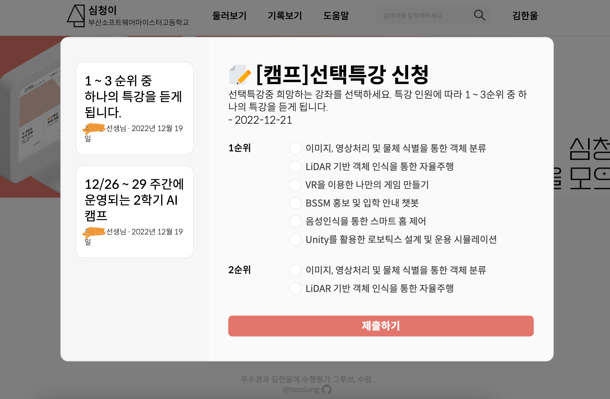
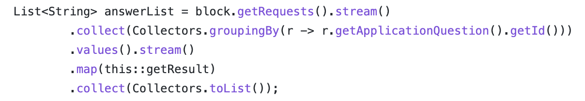
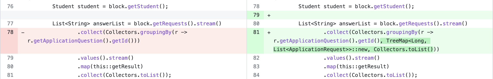
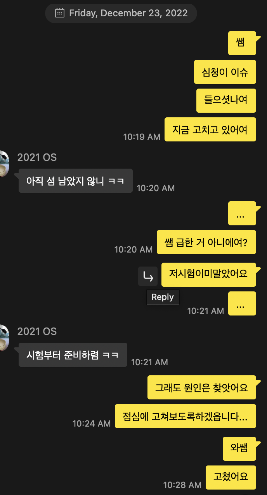

# 이슈 부검

이 글은 **심청이**를 실제로 서비스하는 과정에서 발생한 이슈에 대한 부검이다.

그러니까, 내가 겪은 이슈가 뭐였는지, 어떻게 해결했는지 생생하게 기록하기 위해 이 글을 쓰게 됐다.

이 이슈는 2022년 12월 23일, 크리스마스 이브이브에 생긴 슬픈 이슈이다.

그리고 다른 의미로는 시험 마지막날이어서, 빡자습을 해야 했다.

# 심청이

이슈를 이해하려면, 먼저 심청이가 무엇인지 알아야 한다.

심청이는 2학기 자바 프로젝트의 수행평가로 만든 웹이다.

간단하게 말하자면, **우리 학교에서 쓰는 구글폼을 다 모아놓은 것**이다.

학생 입장에서는

- 학교에서 조사해야 할 신청들을 모아 놓아서 편하다.
- 학번 입력도 안 해도 된다.

선생님 입장에서는

- 홍보를 하고 나서는, 구글폼 링크 다시 달라는 땡깡을 안 받아도 된다.
- 공지사항을 매번 카톡으로 일일이 전달해야 했는데, 이젠 심청이에서 한 번만 하면 된다.

등등의 장점이 있는 아주 **매력적인** 플랫폼이다. ㅎㅎ.

# 발생

내가 이 이슈를 알게 된 건 친구의 제보였다.

진짜 무슨 크리스마스 선물 마냥 아침 7시에 화장실에 양치를 하러 들어가는데 이 카톡이 왔다. 한 선생님께서 그 다음주에 진행하는 AI 캠프에서 선택 특강의 1, 2, 3순위를 심청이를 통해 받았는데, 배정이 이상하게 됐다는 카톡이었다.

# 분석

## **1, 2, 3순위가 무작위로 제각각 바뀌었다**

세 개가 완전히 반대로 바뀐 게 아니었다. 심지어 순서가 맞아 떨어지는 애들도 있었다.

해당 선택 특강 신청 이전에, 다른 신청을 진행했을 때는 이런 문제가 발생하지 않았기 때문에 완전히 바뀐 것은 아니라고 확신했다.

## 대체 왜 바뀌었을까…

솔직히 이전에 만들어서 서비스 했던 신청들에서는 같은 문제가 발생하지 않고 잘 나왔기 때문에 이런 문제가 왜 발생했는지 이해가 되지 않았다.

내가 눈물의 양치를 하고 눈물의 샤워를 하면서 짐작한 문제 상황은 이거다.

- 엑셀 파일로 export 하는 과정에서 섞였다. (라이브러리 탓)
- DB에서 쿼리해서 가져올 때  섞여서 가져온다. (DB 탓)
- DISTNICT(중복제거) 실행할 때 섞인다. (이건 자바 탓)

아무튼 남탓만 엄청 했다. (⇒ 코드 저렇게 짠 내 탓이다)

## 코드 보면서 원인 찾기

전교에서 욕을 먹고 있다는 두려움 + 선생님들의(⇒ 심청이 주요 사용자) 신뢰성 떡락 예상 + 곧 볼 국어 시험은 어떡하지…? 이 세 가지 마음이 휘몰아쳤다.

나는 국어 시험보다 심청이를 선택했다. 하지만 이상했다.

- 에러: 안 남.
- 엑셀 파일로 export 하는 과정에서: 안 섞임.
  - 추출은 프론트엔드 단에서 라이브러리를 사용해서 했기 때문에, 결과 화면만 보면 됐다.
  - 결과 화면에서 이미 섞여있었다.
  - 이미 섞인 걸 섞인 채로 잘 가져오고 있는 거였다.
- DB에서 쿼리해서 가져올 때: 안 섞임.
  - 응답에 `order by` 를 안 넣어줘서 섞이나 했는데, 안 넣어도 id 순서대로 잘 가져오고 있었다.
- DISTINCT 실행할 때: 안 섞임.
  - `stream()` 의 distinct 를 사용했는데 안 섞였다.

내가 예상한 건 다 틀렸고, 멘붕이 찾아왔다.

## 겨우 찾은 원인

원인은 바로 이 코드였다.

groupingBy 메서드가 인자로 넘긴 값을 기준으로 그룹으로 묶어서 Map 형태로 반환하는 역할을 하는데 이 과정에서 값이 섞였다.

# 해결

어떻게 해결할지도 참 고민이었다.

- querydsl 을 도입해서 group by 쓰기
- JPQL native query로 group by 도전하기
- id 기준으로 한 번 더 정렬해주기

정도를 해결책으로 떠올렸다.

## 나는 국어 시험을 앞둔 K-고딩

이 사실을 망각하고 제대로 고쳐볼까 하다가, 국어 시험에 시조가 나온다는 사실을 깨달았다.

그래서 그냥 id 기준으로 한 번 더 정렬하는 간단한 방법을 택했다.

## 근데 외않되?…

생각보다 key 값을 기준으로 Map을 정렬해서 values를 빼오는 건 힘들었다.

여기서 시간을 많이 날려먹었다. 자바 친구에게 좀 화가 났다.

솔직히 코드를 구구절절 길게 짜서 빼오면 금방 되긴 하는데, 이건 내가 싫었다.

그렇게 눈물로 바다 하나 만들고 있을 때 이슬 같은 존재를 알게 된다.

## TreeMap

환호하자. 이 친구는 자동으로 key 값을 정렬해주는 친구이다.

그냥 값을 넣으면 알아서 정렬해준다.

귀엽다. 사랑스럽다. 자세히 안 봐도 사랑스럽다.

# 느낀 점과 배운 점과 깨달은 점과…

- 솔직히 **Hotfix**라는 말이 왜 있는지 이해를 못했는데, 바로 이런 상황을 위해서 있다는 걸 깨달았다.
- 내 잘못된 코드 떄문에 일정이 꼬이면 어떡하지… 라는 생각 + 불안감에 휩싸여서 긴장되는 3시간을 보냈다.
- 애초에 깔끔한 로직을 짰으면… 같은 후회를 했다.
- 실제로 서비스하는 것에 대한 책임감을 크게 느꼈다.
- 앞으로 짜는 코드에는 책임감을 한 움큼씩 담고 짜야겠다고 다짐했다.

# 비하인드

> 😀 참고로 국어 시험은 전교 1등 했다.
